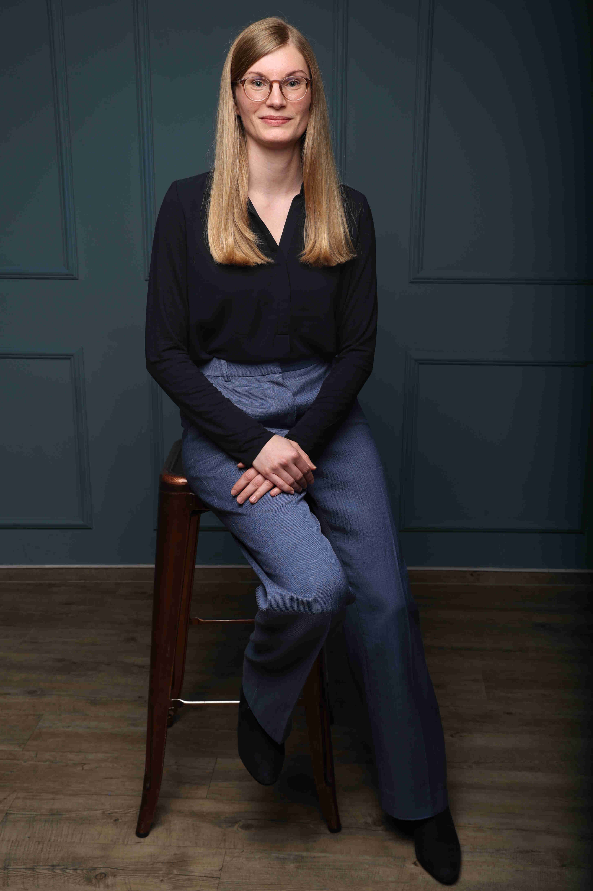

{:height="300px" width="200px"}

I am an Econometrician at the University of Bayreuth. I specialize in both theoretical and applied econometrics, with a primary focus on panel data econometrics. Previously, I was a postdoctoral researcher at the Ruhr-University Bochum. I received my PhD from the Heinrich-Heine University Düsseldorf.
